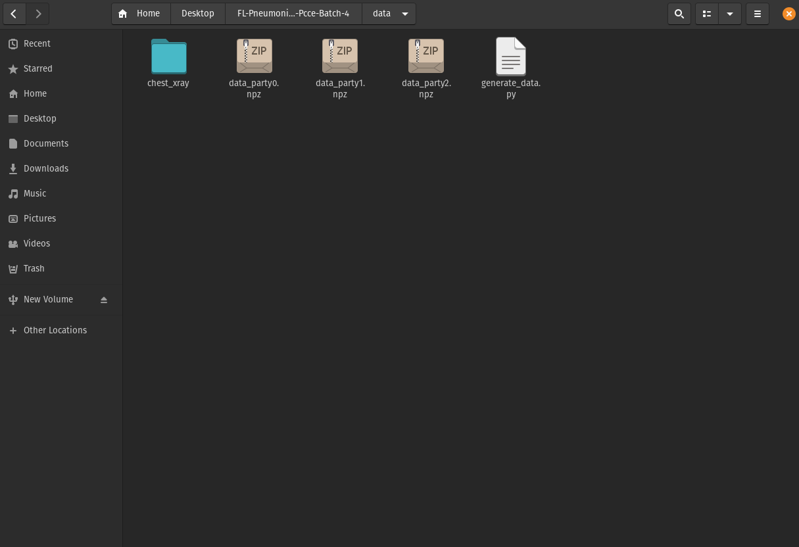
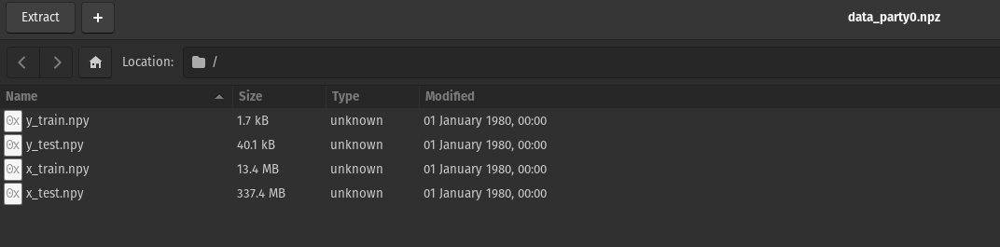

# FL-Pneumonia-Classifier-Pcce-Batch-4

Pneumonia Classifier AI, built using IBM-FL Library

## Step 1

Go the federated learning library directory.

```commandline
cd <path_to_whl_directory>
```

create a conda env

```commandline
conda create -n <env_name> python=3.6
```

Activate the environment with the following command

```commandline
conda activate <env_name>
```

and install IBM-FL

```commandline
pip install <IBM_federated_learning_whl_file>
```

## Step 2

Switch to the data directory

```commandline
cd <path_to_data_directory>
```

Download the Dataset to this directory from [here](https://www.kaggle.com/paultimothymooney/chest-xray-pneumonia)

type the following command in your Command Line

```commandline
python generate_data.py
```

This will generate 3 datasets in npz format containing 4 npy files
x_train
y_train
x_test
y_test





## Step 3

Generate the configs cd into the project folder and type the following into the commanline

```commandline
python classifiers/generate_configs.py -n 3 -m pneumonia-classifier -d xray -p data/chest-xray
```

-n defines the number of party networks
-m defines the model we will be using to train
-d defines the dataset
-p defines the data path

## Step 4

Once the configs are generated we can inititalize the aggregator

```commandline
python -m ibmfl.aggregator.aggregator classifiers/configs/pneumonia-classifier/config_agg.yml
```

Once initialized type `START` in the terminal. This will start the aggregator network.

Open 3 new terminals activate the enviroment and then type

```commandline
python -m ibmfl.party.party examples/configs/keras_classifier/config_party<idx>.yml
```

change the index from 0 to 2 in every terminal. Once all are parties are initialized type `START` and `REGISTER` in each one.

## Step 5

Type `TRAIN` in the aggregator terminal to start the training.

Type `EVAL` to evaluate the network post training.

## Note

* To improve training change the values in the for loop of the `generate_data.py` file and increase the number of images the model trains on.

* The size of the image can be made larger by changing the height and width input in the `generate_data.py` file. This will improve the ability of the network to train better on the given data

* Our Processor could not handle more than 200 images per party and hence were not increased in number, for better accuracy the number recommened would be 400.

* We used images that were scaled down to 150*150 pixels resulting in more loss during the 1st round, the network trains better on higher resolution images.